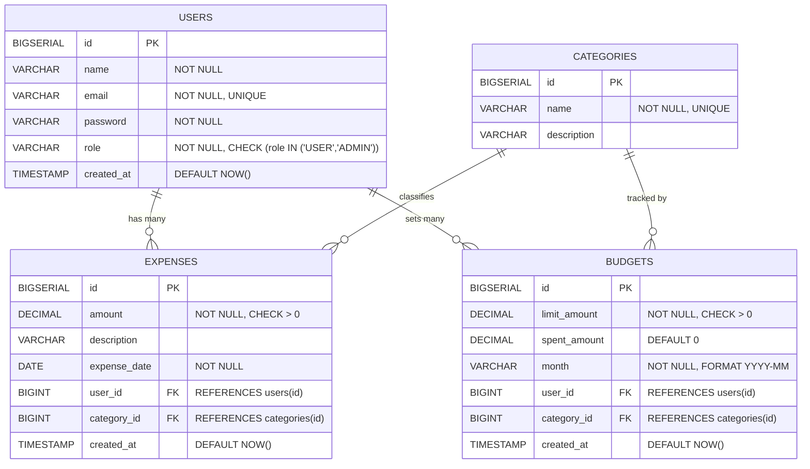

# ER Diagram — SEBMS

## Overview

This diagram defines the **PostgreSQL relational schema** with four core tables, their columns, primary/foreign keys, and constraints.

---

## Mermaid ER Diagram

---

## Table Details

### users

| Column | Type | Constraints |
|--------|------|-------------|
| id | BIGSERIAL | PRIMARY KEY |
| name | VARCHAR(100) | NOT NULL |
| email | VARCHAR(150) | NOT NULL, UNIQUE |
| password | VARCHAR(255) | NOT NULL (BCrypt hashed) |
| role | VARCHAR(20) | NOT NULL, DEFAULT 'USER' |
| created_at | TIMESTAMP | DEFAULT NOW() |

### categories

| Column | Type | Constraints |
|--------|------|-------------|
| id | BIGSERIAL | PRIMARY KEY |
| name | VARCHAR(100) | NOT NULL, UNIQUE |
| description | VARCHAR(255) | Optional |

### expenses

| Column | Type | Constraints |
|--------|------|-------------|
| id | BIGSERIAL | PRIMARY KEY |
| amount | DECIMAL(12,2) | NOT NULL, CHECK (amount > 0) |
| description | VARCHAR(255) | Optional |
| expense_date | DATE | NOT NULL |
| user_id | BIGINT | FK → users(id), ON DELETE CASCADE |
| category_id | BIGINT | FK → categories(id), ON DELETE RESTRICT |
| created_at | TIMESTAMP | DEFAULT NOW() |

### budgets

| Column | Type | Constraints |
|--------|------|-------------|
| id | BIGSERIAL | PRIMARY KEY |
| limit_amount | DECIMAL(12,2) | NOT NULL, CHECK (limit_amount > 0) |
| spent_amount | DECIMAL(12,2) | NOT NULL, DEFAULT 0 |
| month | VARCHAR(7) | NOT NULL (format: YYYY-MM) |
| user_id | BIGINT | FK → users(id), ON DELETE CASCADE |
| category_id | BIGINT | FK → categories(id), ON DELETE RESTRICT |
| created_at | TIMESTAMP | DEFAULT NOW() |

**Unique Constraint:** `(user_id, category_id, month)` — one budget per user per category per month

---

## Relationships

| From | To | Cardinality | FK Rule |
|------|----|-------------|---------|
| users | expenses | One-to-Many | ON DELETE CASCADE |
| users | budgets | One-to-Many | ON DELETE CASCADE |
| categories | expenses | One-to-Many | ON DELETE RESTRICT |
| categories | budgets | One-to-Many | ON DELETE RESTRICT |

---

## Design Notes

- **CASCADE** on user deletion removes all associated expenses and budgets
- **RESTRICT** on category deletion prevents removing categories with linked records
- **Unique constraint** on budgets ensures no duplicate budget entries per user/category/month
