# Class Diagram — SEBMS

## Overview

This diagram shows the major backend classes organized by the **layered architecture**: Entity → Repository → Service → Controller, along with DTOs and security components. Getters/setters are omitted for clarity — all entity fields use standard JavaBean conventions.

---

## Mermaid Class Diagram

```mermaid
classDiagram
    direction TB

    %% ── Enum ──
    class Role {
        <<enumeration>>
        USER
        ADMIN
    }

    %% ══════════════════════════════
    %% ENTITY LAYER
    %% ══════════════════════════════

    class User {
        -Long id
        -String name
        -String email
        -String password
        -Role role
        -LocalDateTime createdAt
    }

    class Expense {
        -Long id
        -Double amount
        -String description
        -LocalDate date
        -LocalDateTime createdAt
    }

    class Budget {
        -Long id
        -Double limitAmount
        -Double spentAmount
        -String month
        +getRemainingAmount() Double
        +isExceeded() boolean
    }

    class Category {
        -Long id
        -String name
        -String description
    }

    %% ══════════════════════════════
    %% DTO LAYER
    %% ══════════════════════════════

    class ExpenseDTO {
        <<DTO>>
        -Double amount
        -Long categoryId
        -LocalDate date
        -String description
    }

    class BudgetDTO {
        <<DTO>>
        -Long categoryId
        -Double limitAmount
        -String month
    }

    class LoginRequest {
        <<DTO>>
        -String email
        -String password
    }

    class AuthResponse {
        <<DTO>>
        -String accessToken
        -String role
    }

    class ExpenseResponseDTO {
        <<DTO>>
        -Long id
        -Double amount
        -String categoryName
        -LocalDate date
        -String description
        -String budgetWarning
    }

    %% ══════════════════════════════
    %% REPOSITORY LAYER (Interfaces)
    %% ══════════════════════════════

    class UserRepository {
        <<interface>>
        +findByEmail(email) Optional~User~
    }

    class ExpenseRepository {
        <<interface>>
        +findByUserId(userId) List~Expense~
    }

    class BudgetRepository {
        <<interface>>
        +findByUserIdAndCategoryIdAndMonth(userId, categoryId, month) Optional~Budget~
    }

    class CategoryRepository {
        <<interface>>
        +findByName(name) Optional~Category~
    }

    %% ══════════════════════════════
    %% SERVICE LAYER
    %% ══════════════════════════════

    class AuthService {
        <<interface>>
        +register(User) User
        +login(LoginRequest) AuthResponse
    }

    class AuthServiceImpl {
        -UserRepository userRepo
        -JwtTokenProvider tokenProvider
        +register(User) User
        +login(LoginRequest) AuthResponse
    }

    class ExpenseService {
        <<interface>>
        +createExpense(userId, ExpenseDTO) Expense
        +getExpenses(userId) List~Expense~
        +updateExpense(userId, expenseId, ExpenseDTO) Expense
        +deleteExpense(userId, expenseId) void
    }

    class ExpenseServiceImpl {
        -ExpenseRepository expenseRepo
        -BudgetService budgetService
        +createExpense(userId, ExpenseDTO) Expense
        +getExpenses(userId) List~Expense~
        +updateExpense(userId, expenseId, ExpenseDTO) Expense
        +deleteExpense(userId, expenseId) void
    }

    class BudgetService {
        <<interface>>
        +createBudget(userId, BudgetDTO) Budget
        +getBudgets(userId, month) List~Budget~
        +checkBudget(userId, categoryId, month) Budget
        +updateSpentAmount(userId, categoryId, month, amount) void
    }

    class BudgetServiceImpl {
        -BudgetRepository budgetRepo
        +createBudget(userId, BudgetDTO) Budget
        +getBudgets(userId, month) List~Budget~
        +checkBudget(userId, categoryId, month) Budget
        +updateSpentAmount(userId, categoryId, month, amount) void
    }

    class CategoryService {
        <<interface>>
        +createCategory(Category) Category
        +getAllCategories() List~Category~
        +deleteCategory(id) void
    }

    class CategoryServiceImpl {
        -CategoryRepository categoryRepo
        +createCategory(Category) Category
        +getAllCategories() List~Category~
        +deleteCategory(id) void
    }

    %% ══════════════════════════════
    %% SECURITY
    %% ══════════════════════════════

    class JwtTokenProvider {
        +generateToken(User) String
        +validateToken(token) boolean
        +getUserIdFromToken(token) Long
    }

    class JwtAuthFilter {
        -JwtTokenProvider tokenProvider
        +doFilterInternal(request, response, chain) void
    }

    %% ══════════════════════════════
    %% CONTROLLER LAYER
    %% ══════════════════════════════

    class AuthController {
        -AuthService authService
        +register(User) ResponseEntity
        +login(LoginRequest) ResponseEntity
    }

    class ExpenseController {
        -ExpenseService expenseService
        +addExpense(userId, ExpenseDTO) ResponseEntity
        +getExpenses(userId) ResponseEntity
        +updateExpense(userId, id, ExpenseDTO) ResponseEntity
        +deleteExpense(userId, id) ResponseEntity
    }

    class BudgetController {
        -BudgetService budgetService
        +createBudget(userId, BudgetDTO) ResponseEntity
        +getBudgets(userId, month) ResponseEntity
    }

    class CategoryController {
        -CategoryService categoryService
        +getAll() ResponseEntity
        +create(Category) ResponseEntity
        +delete(id) ResponseEntity
    }

    %% ══════════════════════════════
    %% RELATIONSHIPS
    %% ══════════════════════════════

    %% Entity relationships
    User "1" --> "*" Expense : owns
    User "1" --> "*" Budget : sets
    Expense "*" --> "1" Category : belongs to
    Budget "*" --> "1" Category : tracks
    User --> Role : has

    %% Interface implementations
    AuthService <|.. AuthServiceImpl : implements
    ExpenseService <|.. ExpenseServiceImpl : implements
    BudgetService <|.. BudgetServiceImpl : implements
    CategoryService <|.. CategoryServiceImpl : implements

    %% Service → Repository
    AuthServiceImpl --> UserRepository
    ExpenseServiceImpl --> ExpenseRepository
    BudgetServiceImpl --> BudgetRepository
    CategoryServiceImpl --> CategoryRepository
    ExpenseServiceImpl --> BudgetService

    %% Controller → Service (depends on interface)
    AuthController --> AuthService
    ExpenseController --> ExpenseService
    BudgetController --> BudgetService
    CategoryController --> CategoryService

    %% Security
    JwtAuthFilter --> JwtTokenProvider
    AuthServiceImpl --> JwtTokenProvider
```

---

## Design Patterns Used

| Pattern | Where | Purpose |
|---------|-------|---------|
| **Repository** | `*Repository` interfaces | Abstract data access behind interfaces |
| **Service Layer** | `*Service` + `*ServiceImpl` | Centralize business logic |
| **DTO** | `ExpenseDTO`, `BudgetDTO`, `LoginRequest`, `AuthResponse` | Separate API contract from internal entities |
| **Dependency Injection** | All layers | Spring IoC wires dependencies |
| **Filter** | `JwtAuthFilter` | Cross-cutting authentication concern |

---

## SOLID Mapping

| Principle | Evidence |
|-----------|----------|
| **SRP** | Controllers handle HTTP; Services handle logic; Repositories handle data |
| **OCP** | New services can be added without changing existing ones |
| **LSP** | Any `*ServiceImpl` can replace its interface |
| **ISP** | Separate interfaces per domain (`ExpenseService`, `BudgetService`, etc.) |
| **DIP** | Controllers depend on service interfaces, not concrete classes |
