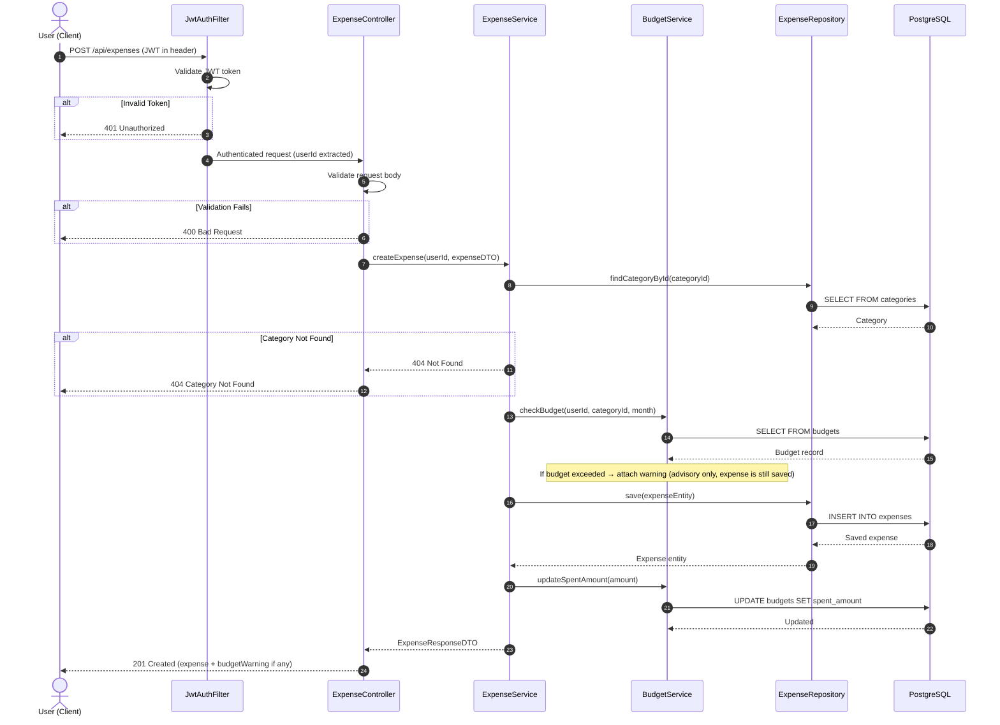

# Sequence Diagram — Add Expense Flow

## Overview

This diagram traces the **Add Expense** request through the layered architecture:

**Client → JWT Filter → Controller → Service → Repository → Database**

---

## Mermaid Sequence Diagram

---

## Flow Summary

| Step | Layer | Action |
|------|-------|--------|
| 1–2 | Filter | Validate JWT token from Authorization header |
| 3–4 | Controller | Validate request body (amount, categoryId, date) |
| 5–7 | Service | Verify that the category exists |
| 8–9 | Service | Check if adding this expense exceeds the monthly budget |
| 10–12 | Repository | Persist the expense to the database |
| 13–14 | Service | Update the spent amount on the matching budget record |
| 15–16 | Controller | Return 201 Created with expense data |

---

## Design Notes

- **Budget warning is advisory** — the expense is saved regardless of budget status
- **JWT is stateless** — validated on every request via the filter, no server-side sessions
- **DTO pattern** — input (`ExpenseDTO`) and output (`ExpenseResponseDTO`) are separate from the `Expense` entity
