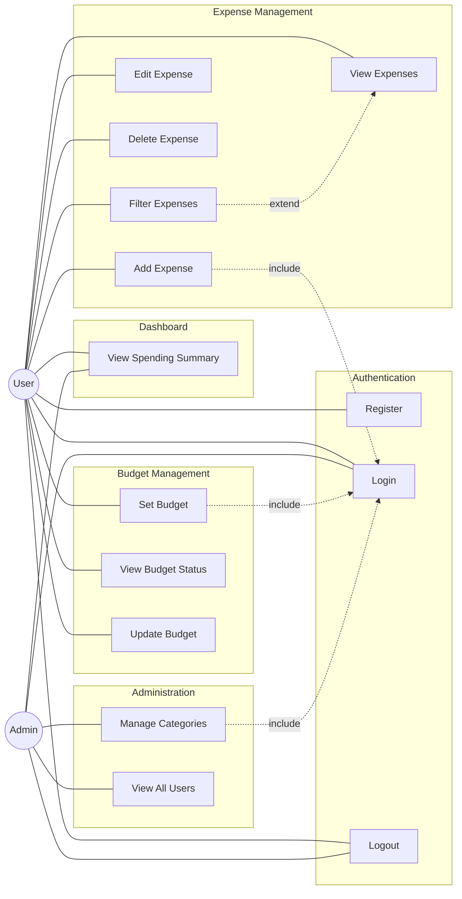

# Use Case Diagram — SEBMS

## Actors

| Actor | Description |
|-------|-------------|
| **User** | Registered user who manages personal expenses and budgets |
| **Admin** | Administrator who manages categories and oversees users (inherits User capabilities) |

---

## Mermaid Use Case Diagram

---

## Use Case Descriptions

### Authentication

| ID | Use Case | Actor | Description |
|----|----------|-------|-------------|
| UC1 | Register | User | Create a new account with name, email, password |
| UC2 | Login | User, Admin | Authenticate and receive a JWT token |
| UC3 | Logout | User, Admin | Discard JWT on client side |

### Expense Management

| ID | Use Case | Actor | Pre-condition | Description |
|----|----------|-------|---------------|-------------|
| UC4 | Add Expense | User | Logged in | Record amount, category, date, description |
| UC5 | View Expenses | User | Logged in | List personal expenses |
| UC6 | Edit Expense | User | Logged in, owns expense | Update an existing expense |
| UC7 | Delete Expense | User | Logged in, owns expense | Remove an expense |
| UC8 | Filter Expenses | User | Logged in | Filter by date or category *(extends UC5)* |

### Budget Management

| ID | Use Case | Actor | Pre-condition | Description |
|----|----------|-------|---------------|-------------|
| UC9 | Set Budget | User | Logged in | Set monthly limit for a category |
| UC10 | View Budget Status | User | Logged in | See budget vs. actual per category |
| UC11 | Update Budget | User | Logged in | Modify an existing budget |

### Dashboard & Administration

| ID | Use Case | Actor | Description |
|----|----------|-------|-------------|
| UC12 | View Spending Summary | User, Admin | Monthly totals and category breakdown |
| UC13 | Manage Categories | Admin | Create, update, or delete categories |
| UC14 | View All Users | Admin | View registered user list |

---

## Key Relationships

| Type | From → To | Meaning |
|------|-----------|---------|
| **include** | UC4, UC9, UC13 → UC2 | Requires authentication |
| **extend** | UC8 → UC5 | Optional filtering extends View Expenses |
| **Generalization** | Admin → User | Admin inherits all User capabilities |
